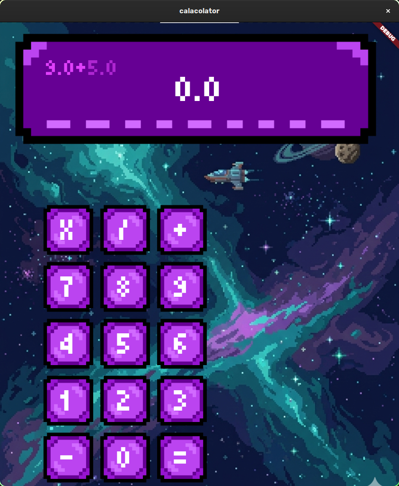

# Pixel Calculator

A Flutter-based calculator UI experiment with REST API integration to explore backend communication.

---

## What I built

- Pixel-style calculator UI in Flutter  
- REST API integration for backend communication  
- Basic full-stack interaction flow (frontend ↔ backend)

  

---

## Status

Backend is currently offline, so API features are not active.

UI and core design remain fully functional.
